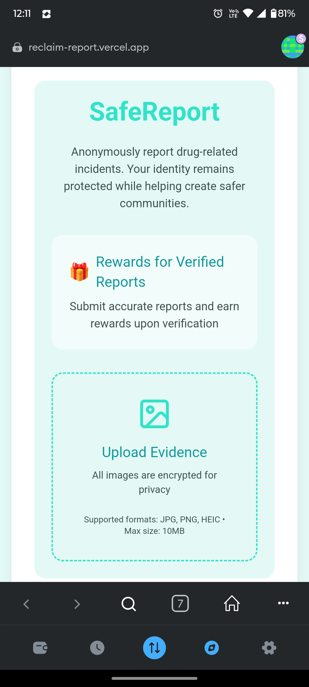

# Reclaim

<p align="center">
  
</p>

Reclaim is a comprehensive mobile application designed to support individuals on their journey to recovery and sobriety. The app provides a supportive ecosystem with professional help, community support, and personal tracking tools.

## 📱 Screenshots

<p align="center">
  
  
  
</p>

<p align="center">
  
  
  
</p>

<p align="center">
  
  
  
</p>

<p align="center">
  
  
  
</p>

## 📦 Latest Release

<div>

### Version 1.0.0


- Initial release
- Complete recovery support ecosystem
- Professional consultation features
- Community support integration
- Progress tracking tools

[](https://github.com/abelboby/reclaim/releases/latest)


</div>

## ✨ Features

- **Professional Consultation**: Connect with qualified medical professionals and counselors
- **Support Groups**: Find and join local support groups
- **Progress Tracking**: Monitor your sobriety journey with detailed statistics
- **News Feed**: Stay updated with relevant recovery-related news and articles
- **Chat Support**: Get immediate assistance through our chat feature
- **Resource Center**: Access to educational materials and recovery resources
- **Appointment Management**: Schedule and manage appointments with healthcare providers
- **Blockchain-Based Anonymous Reports**: Submit completely anonymous reports using Ethereum's Sepolia testnet, ensuring privacy and immutability
  - MetaMask integration for secure blockchain transactions
  - Reports stored on Sepolia testnet for transparency
  - Zero-knowledge proof implementation for anonymity
  - Decentralized storage ensuring report integrity

## 🔗 Blockchain Integration

### Anonymous Reporting System
The anonymous reporting feature is built on Ethereum's Sepolia testnet, providing:
- **Complete Anonymity**: Users can submit reports without revealing their identity
- **Immutable Records**: All reports are permanently stored on the blockchain
- **Transparent Verification**: Reports can be verified while maintaining reporter privacy
- **MetaMask Integration**: Easy-to-use blockchain interaction through MetaMask wallet

### Technical Details
- **Network**: Ethereum Sepolia Testnet
- **Smart Contract Address**: `0x...` (to be updated)
- **Required**: MetaMask wallet with Sepolia ETH for gas fees
- **Gas Optimization**: Implemented efficient smart contracts to minimize transaction costs

## 🚀 Getting Started

### Prerequisites

- Flutter (latest version)
- Dart SDK
- Android Studio / Xcode
- Firebase account (for backend services)

### Installation

1. Clone the repository
```bash
git clone https://github.com/abeloby/reclaim.git
```

2. Navigate to the project directory
```bash
cd reclaim
```

3. Install dependencies
```bash
flutter pub get
```

4. Run the app
```bash
flutter run
```

## 🛠️ Built With

- [Flutter](https://flutter.dev/) - UI Framework
- [Firebase](https://firebase.google.com/) - Backend Services
- [Provider](https://pub.dev/packages/provider) - State Management

## 📄 License

This project is licensed under the MIT License - see the [LICENSE](LICENSE) file for details.

## 🤝 Contributing

Contributions are welcome! Please feel free to submit a Pull Request.

## 📞 Support

For support, email support@reclaim.com or join our Slack channel.

---

<p align="center">Made with ❤️ for those on the path to recovery</p>
